# Diabetes prediction model deployment - CI/CD Pipeline To Deploy To Kubernetes Cluster Using Jenkins

## Introduction

This is the project when I first learned about MLE. This repo will help and guide you to build and serve ML model as in a production environment (Google Cloud Platform). I also used tool & technologies to quickly deploy the ML system into production and automate processes during the development and deployment of the ML system.

### System Pipeline

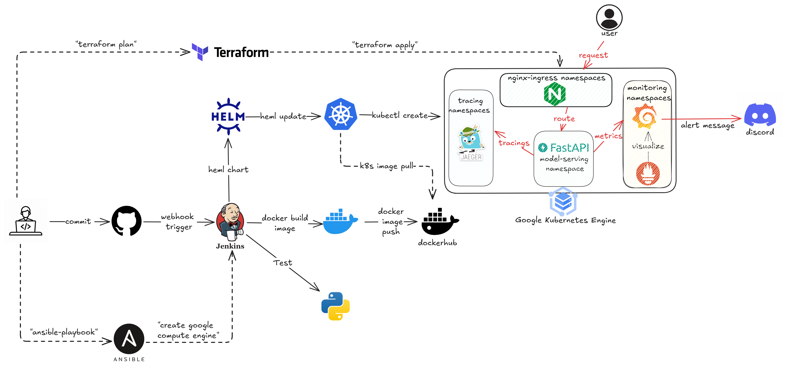

- **Source control**: Git/Github
- **CI/CD**: Jenkins
- **Experiment tracking & Model registry**: MLflow
- **Build API**: FastAPI  
- **Containerize application**: Docker
- **Container orchestration system**: Kubernetes/K8S
- **Data Version Control**: DVC
- **K8s's package manager**: Helm
- **Monitoring tool**: Prometheus, Grafana, Jaegar
- **Deliver infrastructure as code**: Ansible & Terraform
- **Ingress controller**: Nginx ingress
- **Cloud platform**: Google cloud platform/GCP

## Repository Structure

```
diabete_prediction/
├── app/                               # Main application code
│   ├── client.py                      # Client for API testing
│   ├── main.py                        # FastAPI application 
│   ├── tests/                         # Test cases for the application
│   └── utils/                         # Utility functions
├── assets/                            # Images and documentation resources
├── data/                              # Data files
│   └── raw_data/                      # Raw dataset files
├── heml/                              # Helm charts
│   ├── app_chart/                     # Helm chart for the application
│   ├── ingress-nginx/                 # Nginx ingress controller chart
│   ├── jaeger/                        # Jaeger tracing chart
│   └── prometheus-grafana/            # Prometheus & Grafana monitoring 
├── local/                             # Local development setup
│   ├── ansible/                       # Ansible scripts for provisioning
│   └── custom_jenkins/                # Custom Jenkins configuration
├── models/                            # Trained ML models
│   ├── model.pkl                      # Serialized model file
│   └── scaler.gz                      # Feature scaler
├── monitor/                           # Monitoring configurations
│   ├── grafana/                       # Grafana dashboards
│   └── prometheus/                    # Prometheus configurations
├── notebooks/                         # Jupyter notebooks
│   └── EDA_and_experiments.ipynb      # EDA and model training
├── terraform/                         # IaC for GCP resources
│   ├── main.tf                        # Main Terraform configuration
│   ├── providers.tf                   # Provider configurations
│   └── variables.tf                   # Variables for Terraform
├── virtualization/                    # Containerization configs
│   └── mlflow/                        # MLflow server setup
├── Dockerfile                         # Docker configuration
├── Jenkinsfile                        # Jenkins pipeline definition
├── requirements.txt                   # Production dependencies
└── requirements_dev.txt               # Development dependencies
```

## Prerequisites installation:

### Google Cloud Platform: Account Registration & Project Billing

Register for a [Google Cloud Platform](https://console.cloud.google.com/) account

After creating GCP account, let's create your own Project 


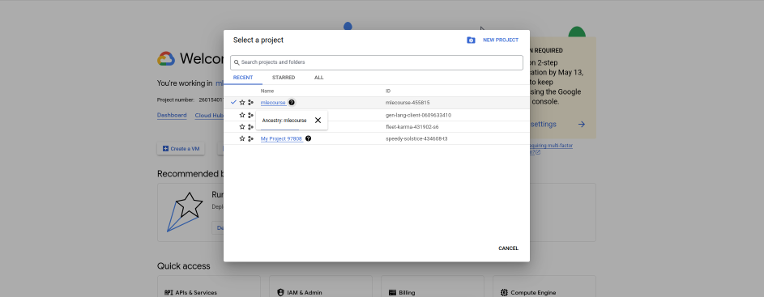

Navigate to [Compute Engine API](https://console.cloud.google.com/marketplace/product/google/compute.googleapis.com) 

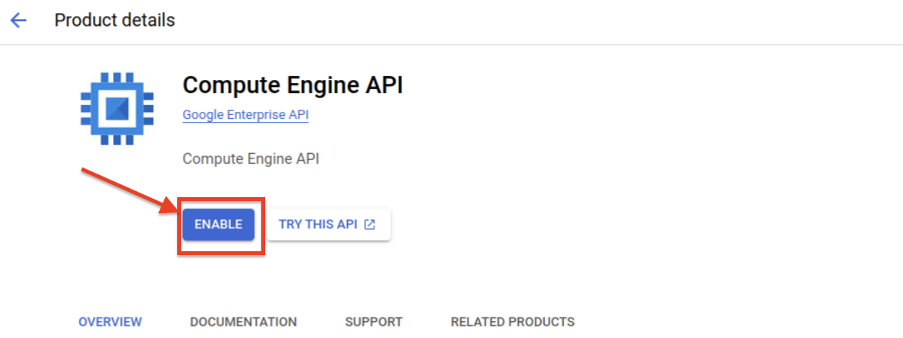

Navigate to [Kubernetes Engine API](https://console.cloud.google.com/marketplace/product/google/container.googleapis.com)

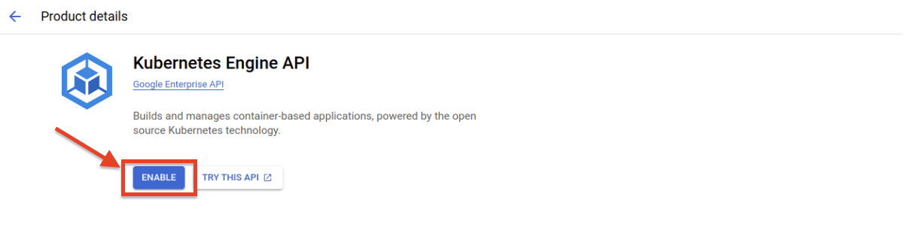

### Install the gcloud CLI

Follow the instructions to [install gcloud CLI](https://cloud.google.com/sdk/docs/install#deb) for your operating system. After installation:

```bash
gcloud init
```
#### Required Tools

Install the following tools:

- [Docker](https://docs.docker.com/desktop/install/ubuntu/)
- [Kubectl](https://kubernetes.io/docs/tasks/tools/install-kubectl-linux/)
- [Helm](https://helm.sh/docs/intro/install/)
- [Terraform](https://developer.hashicorp.com/terraform/tutorials/aws-get-started/install-cli#install-terraform)

#### Development Dependencies

Install the required Python packages:

```bash
pip install -r requirements_dev.txt
```

## Component Preparation

### 1. Infrastructure Setup

#### 1.1. Create Jenkins on Google Cloud VM

Create Jenkins on google cloud VM:

Let's create your Jenkins VM instance using ansible.

Before creating google cloud VM by ansbile, you must first prepare a few things to access the GCP like service account. You can refer to this link Create service account

Note: When creating a service account, grant it Compute admin permission. And then:

    Find the three dots icon in the service account's Actions column, then select Manage keys.
    Click ADD KEY, then Create new key
    Download a JSON file by selecting CREATE. Keep this file SAFE at all times.
    Put your credentials under the folder /local/ansible/secrets

Now create the Jenkins VM instance on GCP:

```bash
cd ./local/ansible/deploy_jenkins
ansible-playbook create_compute_instance.yaml
```

After creating your Jenkins VM instance on GCP, navigate to the VM instances page in Google Cloud Console and copy the external IP of the "jenkins-instance". For example:

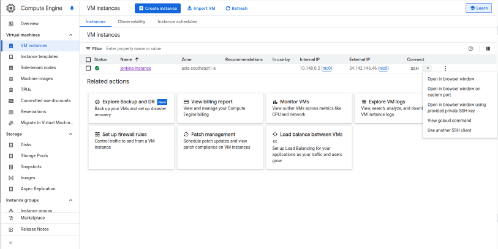

Modify the IP of the newly created instance in the inventory file, then run the following command to deploy Jenkins:

```bash
ansible-playbook -i ../inventory deploy_jenkins.yml
```

#### 1.2. GKE Cluster Deployment with Terraform

Change directory to the `/terraform` folder and initialize a working directory containing Terraform configuration files:

```bash
cd ./terraform
terraform init
```

Before creating an execution plan, you need to authenticate with GCP:

```bash
gcloud auth application-default login
```

Then create an execution plan, which lets you preview the changes that Terraform plans to make to your infrastructure:

```bash
terraform plan
```

Finally, apply the planned changes to create your GKE cluster:

```bash
terraform apply
```

#### 1.3. Connect to the GKE cluster

After terraform apply completes successfully, you have initialized the GKE cluster

   Navigate to the GKE UI in Google Cloud Console:

   Click on your cluster and select "CONNECT":

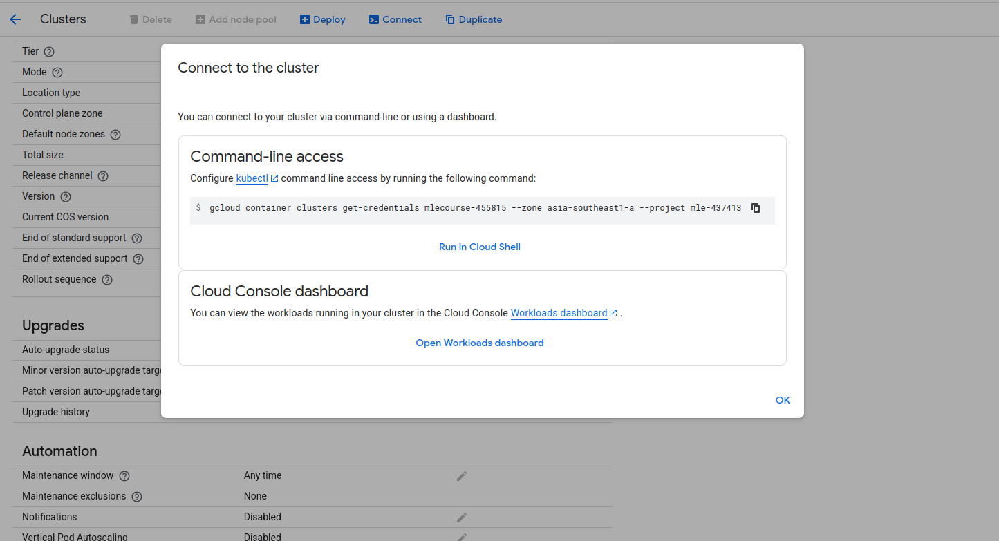

   Copy the `gcloud container ...` command into your local terminal
   Verify the connection by running:

kubectx [YOUR_GKE_CLUSTER_ID]

### 2. Application Deployment

We will use the Helm chart to deploy the application on a GKE cluster.

#### 2.1. Deploy Nginx Ingress Controller

To deploy the Nginx Ingress Controller, follow these steps:

```bash
# Install the Nginx Ingress Controller
helm upgrade --install ingress-nginx ingress-nginx \
  --repo https://kubernetes.github.io/ingress-nginx \
  --namespace ingress-nginx --create-namespace
```

After completing these steps, the Nginx Ingress Controller will be deployed in the ingress-nginx namespace.

#### 2.2. Retrieve the Nginx Ingress IP Address

Once the Nginx Ingress Controller is deployed successfully, retrieve the IP address of the Ingress controller by running:

```bash
kubectl get service ingress-nginx-controller --namespace ingress-nginx
```

Make note of the EXTERNAL-IP value; this is the IP address you'll use to access your application.

#### 2.3. Configure the Domain Name

Edit the /etc/hosts file to map the Ingress IP address to your domain:

```bash
sudo vi /etc/hosts
```

Add the following entry to map the Ingress IP address to your domain:

```
<NGINX_INGRESS_IP>  hn.org.m1
```

Replace `<NGINX_INGRESS_IP>` with the actual IP address you obtained from the previous command.

#### 2.4. Deploy the Prediction API

The deployment of the FastAPI application is handled by a Helm chart:

```bash
# Create namespace for the application
kubectl create namespace model-serving

# Deploy the application using Helm
helm upgrade --install diabetes-app ./heml/app_chart \
  --namespace model-serving \
  --set image.repository=<your-docker-repo>/diabetes-prediction \
  --set image.tag=latest
```

#### 2.5. Access the API Documentation

After the application is deployed, you can access the API documentation by navigating to:

```
http://hn.org.m1/docs
```

### 3. Monitoring & Observability

Prometheus and Grafana form a powerful combination for monitoring and observability. These tools are used to monitor the health of nodes and pods running the application. Prometheus gathers metrics from both nodes and pods within the GKE cluster, while Grafana displays real-time data such as CPU and RAM usage.

#### 3.1. Install Prometheus and Grafana

Change directory to the prometheus-grafana folder and use Helm to install Prometheus and Grafana on the cluster:

```bash
cd ./prometheus-grafana
helm upgrade --install prometheus-grafana-stack -f values-prometheus.yaml kube-prometheus-stack --namespace monitoring --create-namespace
```

#### 3.2. Verify the Installation

After the installation, verify that each monitoring service's host name and ingress IP have been configured correctly:

```bash
kubectl get ingress -n monitoring
```

You should see Ingresses with host names such as "grafana.hn.com," "alertmanager.hn.com," and "prometheus.hn.com" along with their corresponding addresses, indicating a successful installation.

#### 3.3. Configure Local Host Resolution

Take the Ingress IP address and add mappings to your `/etc/hosts` file:

```bash
sudo vi /etc/hosts
```

Add the following lines:

```
35.198.253.81 prometheus.hn.com
35.198.253.81 grafana.hn.com
35.198.253.81 alertmanager.hn.com
```
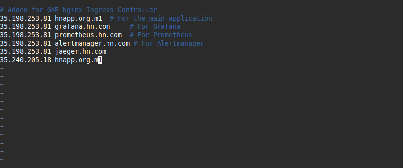

#### 3.4. Accessing Monitoring Services

After updating your hosts file, you can access the services through your browser:

- Grafana Dashboard: http://grafana.hn.com
- Prometheus: http://prometheus.hn.com
- Alertmanager: http://alertmanager.hn.com

#### 3.5. Using Prometheus and Grafana

##### Node Exporter Dashboard

The Node Exporter collects information such as CPU usage, memory usage, disk usage, and network usage. It helps us monitor the health of Kubernetes nodes and troubleshoot performance issues. We can use an existing template dashboard with minimal configuration:

1. Navigate to http://grafana.hn.com
2. Select "Dashboard" from the left sidebar
3. Click the "New" blue box then select "Import"
4. Provide Node Exporter Dashboard ID: "1860" (You can find other ready-made dashboards through Grafana Dashboard repository)
5. Select "Prometheus" as the data source and click "Import"
6. You should now see a comprehensive Node Exporter dashboard displaying system metrics

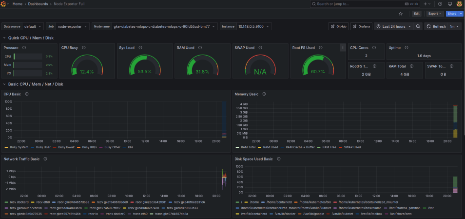

##### OpenTelemetry Metrics Dashboard

To capture and export metrics from the Diabetes Prediction API (counter for "number of requests" and histogram for "response time"), we utilize the OpenTelemetry module. Prometheus scrapes these metrics from port "8099", and Grafana displays them in a customized dashboard:

1. First, check Prometheus Targets to verify it's scraping OpenTelemetry metrics from the API:

 Go to http://prometheus.hn.com/targets

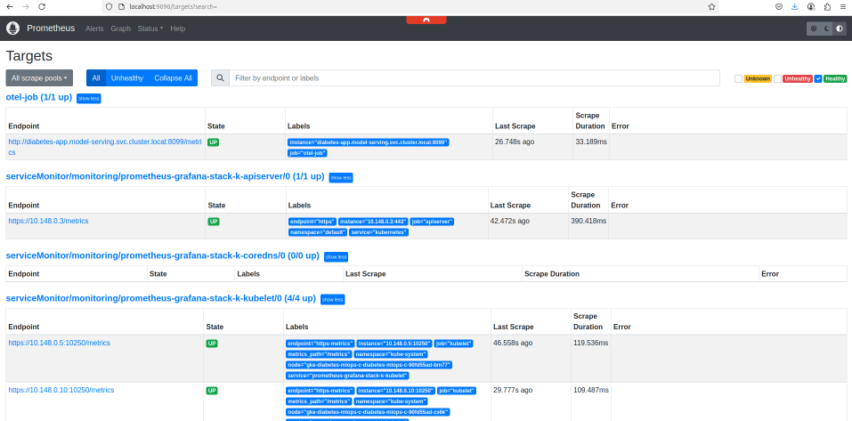

2. Create a new Grafana dashboard:
   - Navigate to Grafana
   - Click "Create" (+ icon) > "Dashboard"
   - Click the blue "Add visualization" button
   - Select "Prometheus" as the data source
   - Add metrics queries like `diabetespred_response_histogram_seconds_count`
   - Customize titles, units, and visualization types as needed

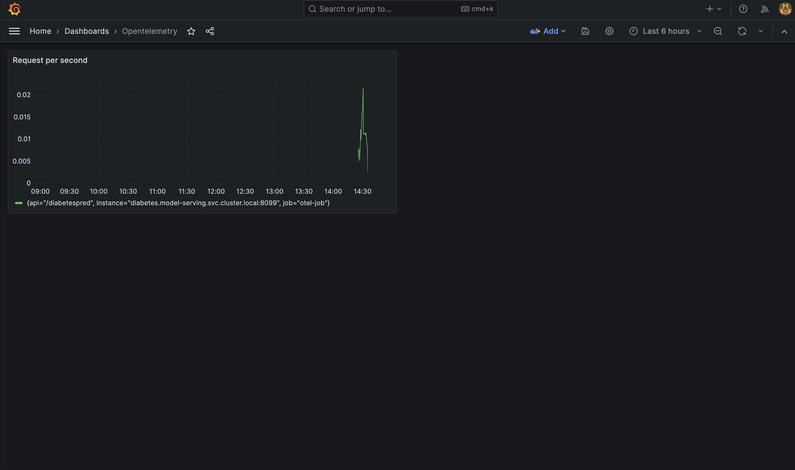

#### 3.6. Prometheus Alerts to Discord with Alertmanager

First, create an alerting rule with additionalPrometheusRules in values-prometheus.yaml file (line 154). You could also simply use the rule I've already built to stay an eye on Node memory.

Setting up a webhook on Discord:

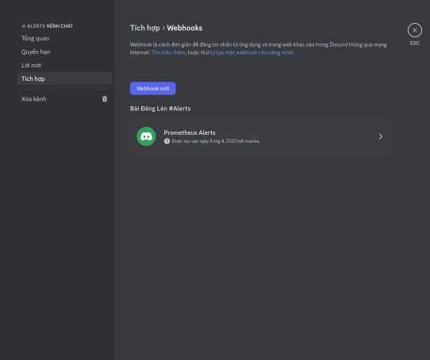

Then go to line 297 in values-prometheus.yaml file to replace the <DISCORD_WEBHOOK_URL> placeholder with the webhook URL you just copied from Discord. It should look something like this: https://discord.com/api/webhooks/XXX/YYY.

The config above will sends all alerts (grouped by alertname and job) to a single Discord receiver.

### 4. Distributed Tracing

To enable distributed tracing and visualize traces across services, we deploy Jaeger. This is useful for debugging, performance analysis, and understanding request flows between components in your FastAPI microservices. We use the OpenTelemetry Collector to export spans to Jaeger.

#### 4.1. Set Up Tracing Namespace

Create and switch to a dedicated namespace for Jaeger:

```bash
kubectl create ns tracing
kubens tracing
```

#### 4.2. Deploy Jaeger with Helm

We use a preconfigured Helm chart to deploy Jaeger along with OpenTelemetry Collector.

Navigate to Helm chart folder:

```bash
cd helm/jaeger
```

Install the Helm release with Jaeger:

```bash
helm upgrade --install jaeger .
```

The jaeger-values.yaml file includes configuration for:
- Jaeger collector and query services
- OpenTelemetry Collector receiver/exporter pipelines
- Ingress for exposing the Jaeger UI

#### 4.3. Configure Host Access

Edit your /etc/hosts file to map the ingress IP to Jaeger's custom domain:

```bash
sudo vim /etc/hosts
```

Add the following line (replace NGINX_EXTERNAL_IP with your actual ingress IP):

```
35.198.253.81 jaeger.hn.com
```

#### 4.4. Accessing Jaeger

Access the Jaeger UI at:
- http://jaeger.hn.com

The FastAPI application is instrumented with OpenTelemetry to send traces to Jaeger, allowing you to visualize the execution flow and performance of requests through your application.

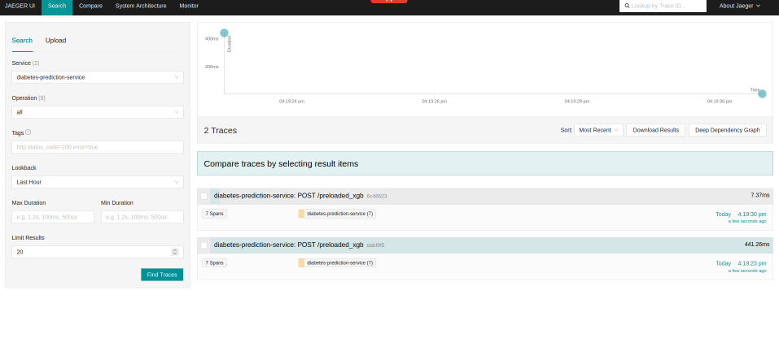

### 5. CI/CD Pipeline

Jenkins is deployed on Google Compute Engine using Ansible with a machine type of e2-standard-2.

#### 5.1. Spin up your instance

Create your service account, and select Compute Admin role (Full control of all Compute Engine resources) for your service account:

1. Create new key as json type for your service account. Download this json file and save it in the `local/ansible/secrets` directory.
2. Update your project and service_account_file in `local/ansible/deploy_jenkins/create_compute_instance.yaml`.

Go back to your terminal, and execute the following commands to create the Compute Engine instance:

```bash
cd local/ansible/deploy_jenkins
ansible-playbook create_compute_instance.yaml
```

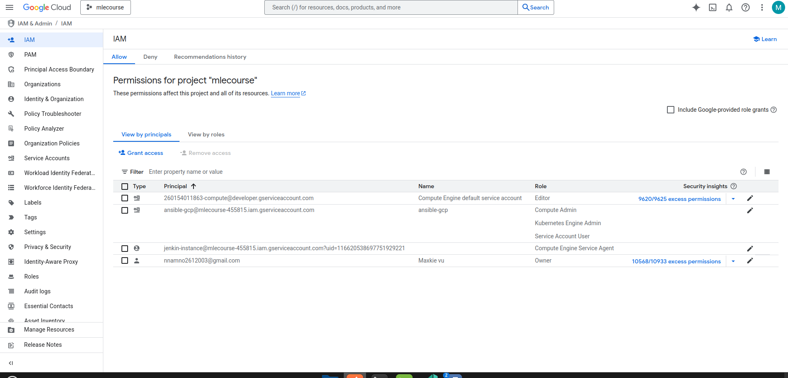

#### 5.2. Install Docker and Jenkins in GCE

```bash
cd local/ansible/deploy_jenkins
ansible-playbook -i ../inventory deploy_jenkins.yml
```

Wait a few minutes for Jenkins to be installed on the Compute Engine instance.

#### 5.3. Connect to Jenkins UI in Compute Engine

Access the instance using the command:

```bash
ssh -i ~/.ssh/id_rsa YOUR_USERNAME@34.142.146.46
```

Open your web browser and navigate to `http://34.142.146.46:8081` to access the Jenkins UI. To unlock Jenkins, execute the following commands:

```bash
sudo docker exec -ti jenkins bash
cat /var/jenkins_home/secrets/initialAdminPassword
```

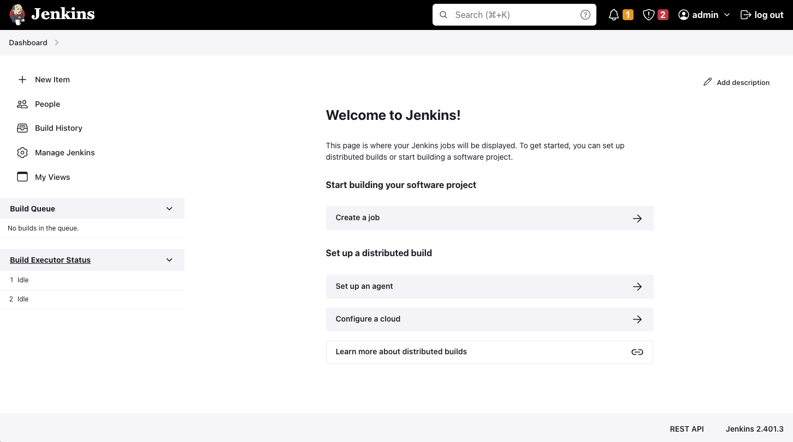

#### 5.4. Setup Jenkins

##### 5.4.1. Add credentials to Jenkins

1. Go to Manage Jenkins > Credentials > System > Global credentials
2. Add Credentials

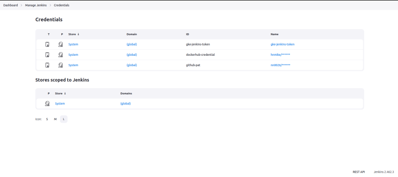

##### 5.4.2. Install required plugins

Install the following plugins at Manage Jenkins > Plugins:
- Kubernetes
- Docker
- Docker Pipeline
- Google Cloud SDK

After successful installation, restart the Jenkins container:

```bash
sudo docker restart jenkins
```
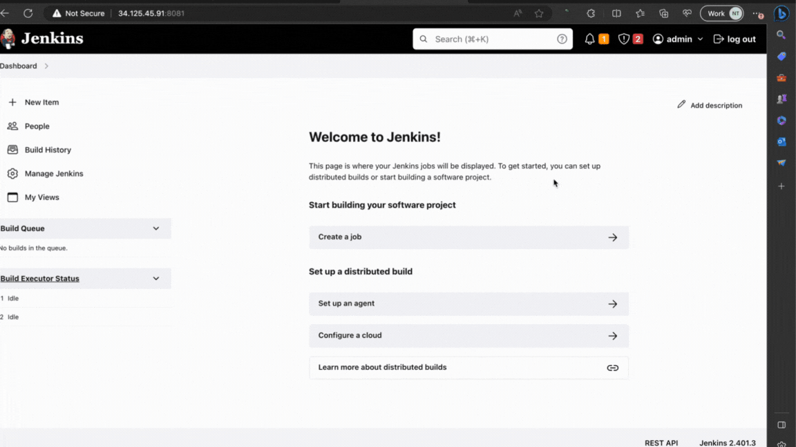

##### 5.4.3. Set up connection to GKE

Set up a connection to GKE by adding the cluster certificate key at Manage Jenkins > Clouds.

Grant necessary permissions to the service account:

```bash
kubectl create namespace model-serving
kubectl create serviceaccount jenkins -n model-serving

kubectl create clusterrolebinding jenkins-cluster-admin \
  --clusterrole=cluster-admin \
  --serviceaccount=model-serving:jenkins
```
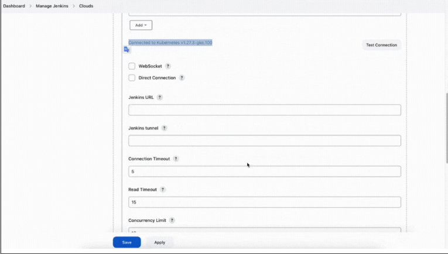

#### 5.5. Continuous Deployment

Create a Multibranch Pipeline in Jenkins:
1. New Item > Multibranch Pipeline
2. Configure the GitHub source with your repository
3. Add credentials for GitHub
4. Save and watch the pipeline run

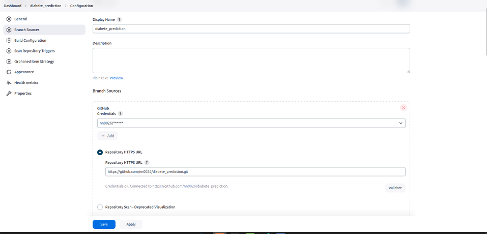

You can confirm the successful deployment if you see the following output in the pipeline log:

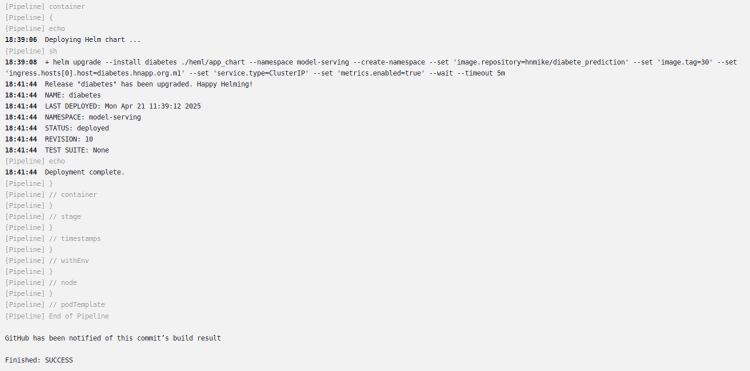

Here is the Stage view in Jenkins pipeline:

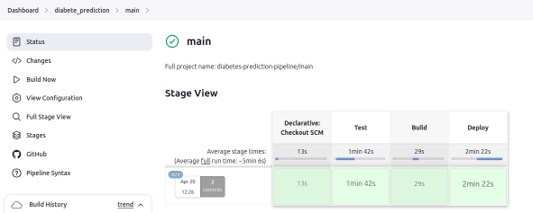

### Test API

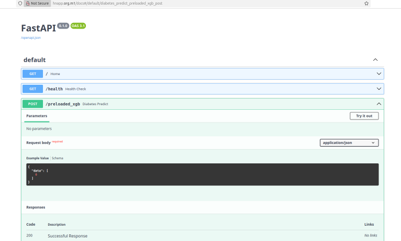


### MLflow Deployment

Deploy MLflow for experiment tracking and model registry:

```bash
pip install mlflow==2.1.1
docker compose -f ./virtualization/mlflow/mlflow-docker-compose.yml up -d
```

Access MLflow at http://localhost:5000/

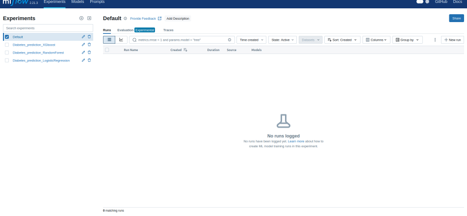

### Data Version Control

Install and use DVC for data versioning:

```bash
pip install dvc==3.30.1
```